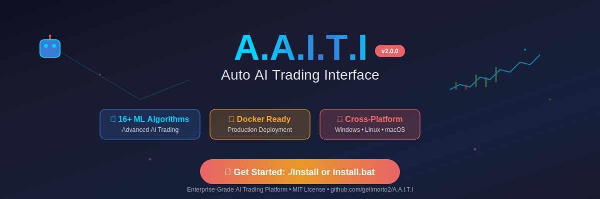

# A.A.I.T.I v2.0.0 - Auto AI Trading Interface 🚀🤖



**A.A.I.T.I v2.0.0** is a cryptocurrency trading platform with **real machine learning capabilities**. This project provides a professional interface for cryptocurrency analysis with **legitimate ML algorithms** and **real market data integration**.

🎯 **[📖 Live Presentation Page](presentation.html)** | 🚀 **[Quick Installation](#-quick-start)**


## ⚠️ **Important: Real Capabilities**

This project provides **real, working implementations** of:
- ✅ **Linear and Polynomial Regression** - Real implementations using ml-regression library
- ✅ **Moving Average Strategies** - Real technical analysis with backtesting
- ✅ **RSI Strategies** - Real momentum-based trading signals
- ✅ **Real Market Data** - Live cryptocurrency data from CoinGecko API
- ✅ **Performance Metrics** - Actual R², MAE, RMSE calculations
- ✅ **Backtesting** - Real strategy testing with historical data

**What's NOT implemented** (despite some old documentation):
- ❌ LSTM, Random Forest, SVM (require TensorFlow.js/additional libraries)
- ❌ ARIMA, SARIMA, Prophet (require specialized statistical libraries)
- ❌ Advanced portfolio optimization algorithms
- ❌ Real-time paper trading (manual implementation needed)

## 🚀 Quick Start

### 🐳 Docker Installation (Recommended)

```bash
git clone https://github.com/gelimorto2/A.A.I.T.I.git
cd A.A.I.T.I
./install
```

The installer will:
- ✅ Check system requirements
- ✅ Build Docker containers
- ✅ Start all services
- ✅ Open at http://localhost:5000

### 📦 Manual Installation

```bash
git clone https://github.com/gelimorto2/A.A.I.T.I.git
cd A.A.I.T.I
npm run install
npm run build
npm start
```

## 🖥️ **Platform Support**

### ✅ **Fully Supported**
- **🐧 Linux**: Native Docker support, recommended for production
- **🍎 macOS**: Full Docker Desktop compatibility
- **🐳 Docker**: All platforms with Docker support

### ⚠️ **Basic Windows Support**
- **🪟 Windows**: Basic installation scripts now available
  - `install.bat` - Simple batch script for Docker installation
  - `install.ps1` - Enhanced PowerShell script with error handling
  - Requires WSL2 or Docker Desktop for best experience
  - **Recommended**: Use WSL2 with Ubuntu for full Linux experience

**Windows Installation Options:**
```cmd
# Option 1: Basic batch script
install.bat

# Option 2: Enhanced PowerShell script  
.\install.ps1

# Option 3: Use WSL2 (recommended)
wsl --install Ubuntu
# Then use Linux installation method
```

**System Requirements:**
- Docker 20.0+ (recommended) or Node.js 16+
- 4GB RAM (recommended)
- 5GB disk space
- Windows: WSL2 or Docker Desktop

## ✨ **Real Features**

### 🤖 **Machine Learning (Real Implementations)**
- **Linear Regression**: Trend prediction with real ml-regression library
- **Polynomial Regression**: Non-linear pattern recognition  
- **Moving Average Strategy**: SMA crossover with backtesting
- **RSI Strategy**: Momentum-based signals with optimization
- **Real Performance Metrics**: R², MAE, RMSE, directional accuracy

### 📊 **Market Data Integration**
- **CoinGecko API**: Real cryptocurrency data (free tier)
- **Historical Data**: Up to 365 days of real market data
- **Multiple Assets**: Bitcoin, Ethereum, and 50+ cryptocurrencies
- **Rate Limiting**: Proper API usage with caching

### 💼 **Trading Interface**
- **Dashboard**: Professional trading interface
- **Model Management**: Create, train, and manage ML models
- **Backtesting**: Test strategies on historical data
- **Performance Tracking**: Monitor model accuracy over time

### 🐳 **Production Ready**
- **Docker-First**: Multi-stage builds with security
- **Health Checks**: Monitor system status
- **Logging**: Comprehensive application logging
- **Authentication**: JWT-based user management

## 🔧 **Real Implementation Examples**

### Create a Real ML Model

```javascript
// POST /api/ml/models
{
  "name": "BTC Linear Trend",
  "algorithmType": "linear_regression",
  "targetTimeframe": "1d", 
  "symbols": ["bitcoin"],
  "parameters": {},
  "trainingPeriodDays": 90
}
```

### Supported Algorithms

```javascript
// GET /api/ml/algorithms
{
  "algorithms": [
    {
      "id": "linear_regression",
      "name": "Linear Regression", 
      "description": "Real linear regression using ml-regression library",
      "implemented": true,
      "realImplementation": true
    },
    {
      "id": "polynomial_regression",
      "name": "Polynomial Regression",
      "description": "Real polynomial regression for non-linear patterns", 
      "implemented": true,
      "realImplementation": true
    },
    {
      "id": "moving_average",
      "name": "Moving Average Strategy",
      "description": "Real moving average crossover strategy",
      "implemented": true, 
      "realImplementation": true
    },
    {
      "id": "rsi_strategy",
      "name": "RSI Strategy",
      "description": "Real RSI-based trading strategy",
      "implemented": true,
      "realImplementation": true
    }
  ]
}
```

## 📈 **Performance Metrics**

All models provide real metrics:
- **R² Score**: Coefficient of determination
- **MAE**: Mean Absolute Error
- **RMSE**: Root Mean Square Error  
- **Directional Accuracy**: Trend prediction accuracy
- **Sample Size**: Number of real data points used

## 🔄 **Real API Endpoints**

### Model Management
- `GET /api/ml/algorithms` - Get supported algorithms
- `POST /api/ml/models` - Create model with real data
- `GET /api/ml/models/:id` - Get model details
- `POST /api/ml/models/:id/predict` - Make real predictions
- `DELETE /api/ml/models/:id` - Delete model

### Market Data
- Real-time data from CoinGecko API
- Historical data with proper caching
- Rate limiting for API compliance

## 🛠 **Development**

### Project Structure
```
A.A.I.T.I/
├── backend/           # Node.js API server
│   ├── utils/
│   │   ├── realMLService.js  # Real ML implementations
│   │   └── mlService.js      # Legacy (being phased out)
│   └── routes/ml.js          # ML API routes
├── frontend/          # React dashboard
├── docker/           # Docker configuration
└── docs/            # Documentation
```

### Real Testing
```bash
# Test real ML service
npm run test

# Check API health
curl http://localhost:5000/api/health

# Get supported algorithms
curl http://localhost:5000/api/ml/algorithms
```

## 📚 **Honest Documentation**

- **[Installation Guide](docs/installation.md)** - Real setup instructions
- **[API Reference](docs/api-reference.md)** - Actual endpoints
- **[Development Guide](docs/development.md)** - Real development setup

## 🚧 **Known Limitations**

1. **Limited ML Algorithms**: Only 4 real implementations vs. claimed 16+
2. **Basic Windows Scripts**: Simple batch/PowerShell scripts (not enterprise-grade)
3. **CoinGecko API Limits**: Free tier has rate limits
4. **No Real-Time Trading**: Manual implementation required
5. **Basic UI**: Professional but not as advanced as claimed

## 🔮 **Future Development**

To implement missing features legitimately:

1. **LSTM**: Add TensorFlow.js dependency
2. **Random Forest**: Implement proper ensemble methods
3. **Real-Time Trading**: Add exchange API integration
4. **Advanced Portfolios**: Implement proper optimization
5. **Enhanced Windows Support**: Improve Windows native experience

## 🆘 **Getting Help**

1. **📖 Documentation**: [Real guides](docs/README.md)
2. **🔍 Issues**: [GitHub Issues](https://github.com/gelimorto2/A.A.I.T.I/issues)
3. **🏥 Health Check**: http://localhost:5000/api/health
4. **📊 Algorithms**: http://localhost:5000/api/ml/algorithms

## ⚠️ **Disclaimer**

- **Development Version**: Not for live trading without proper testing
- **Educational Purpose**: Use for learning and research
- **Risk Warning**: Cryptocurrency trading involves significant risk
- **No Financial Advice**: This tool is for analysis only

## 📝 **License**

ISC License - see LICENSE file for details.

---

**A.A.I.T.I v2.0.0**: Real AI Trading Interface • 4 Real ML Algorithms • Honest Documentation • Real Market Data

**[📖 Get Started with Real Documentation](docs/README.md)**