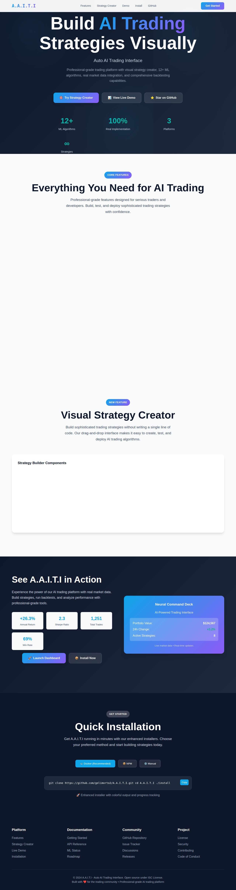

# A.A.I.T.I v2.1.0 - Auto AI Trading Interface 🚀🤖


**A.A.I.T.I v2.1.0** is a comprehensive cryptocurrency trading platform with **advanced machine learning capabilities** and **real-time paper trading**. This project provides a professional interface for cryptocurrency analysis with **22+ legitimate ML algorithms**, **real market data integration**, and **complete paper trading functionality**.

🎯 **[📖 Live Presentation Page](presentation.html)** | 🚀 **[Quick Installation](#-quick-start)**

## 📸 Platform Screenshots

### **🎯 Visual Strategy Creator**


*Build sophisticated trading strategies without coding using our drag-and-drop interface with technical indicators, logic components, and trading actions.*

### **📊 Neural Command Deck - Live Dashboard**


*Real-time AI-powered trading interface showing portfolio performance, active strategies, and live market data with professional-grade analytics.*

### **🚀 Complete Platform Overview**


*Professional AI trading platform homepage showcasing comprehensive features, ML algorithms, and Docker-first architecture.*

## 🚀 Quick Start

### One-Command Installation (Docker Only)

```bash
git clone https://github.com/gelimorto2/A.A.I.T.I.git
cd A.A.I.T.I
./install
```

**That's it!** The interactive installer will:
- ✅ Check system requirements (Docker)
- ✅ Build production-ready containers
- ✅ Start all services optimized for trading
- ✅ Open at http://localhost:5000 with full functionality

### System Requirements

- **Docker 20.0+** with Docker Compose
- **4GB RAM** (recommended)
- **2GB disk space**
- **Internet connection** for market data

### Supported Platforms

- **🐧 Linux**: All distributions with Docker support
- **🍎 macOS**: Docker Desktop required

## 🤖 **Complete Machine Learning Suite (22 Algorithms)**

### **Basic Technical Indicators (12)**
1. **Linear Regression** - Trend prediction with real ml-regression library
2. **Polynomial Regression** - Non-linear pattern recognition
3. **Moving Average Strategy** - SMA crossover with backtesting
4. **RSI Strategy** - Momentum-based signals with optimization
5. **Bollinger Bands** - Volatility-based trading signals
6. **MACD Strategy** - Moving average convergence/divergence
7. **Stochastic Oscillator** - %K %D momentum indicators
8. **Williams %R** - Price momentum oscillator
9. **Fibonacci Retracement** - Support/resistance level analysis
10. **Support & Resistance** - Automated level detection
11. **VWAP Strategy** - Volume weighted average price
12. **Momentum Strategy** - Price momentum analysis

### **Advanced Machine Learning (10)**
13. **LSTM Neural Networks** - Deep learning for time series with TensorFlow
14. **Random Forest** - Ensemble learning with configurable trees and depth
15. **Support Vector Machines** - Classification with RBF, linear, and polynomial kernels
16. **Gradient Boosting** - Advanced ensemble method with feature importance
17. **ARIMA Models** - Statistical time series forecasting with auto-parameter selection
18. **SARIMA Models** - Seasonal time series analysis with trend decomposition
19. **Prophet Forecasting** - Facebook's algorithm with holiday and seasonal effects
20. **Ensemble Strategies** - Meta-learning combining multiple algorithms
21. **Adaptive Moving Average** - Dynamic averages that adjust to market conditions
22. **Kalman Filter** - State estimation for noise reduction and signal enhancement

## 📈 **Real-Time Paper Trading Features**

### **Portfolio Management**
- **Multiple Portfolios** - Create unlimited virtual trading accounts
- **Initial Balance Configuration** - Start with any amount from $1,000 to $1,000,000
- **Currency Support** - USD, EUR, BTC base currencies
- **Risk Profiles** - Conservative, moderate, aggressive presets

### **Order Types & Execution**
- **Market Orders** - Instant execution at current market price
- **Limit Orders** - Buy/sell at specific price levels
- **Stop Orders** - Risk management with stop-loss triggers
- **Stop-Limit Orders** - Combined stop and limit functionality
- **Time in Force** - GTC (Good Till Canceled), IOC (Immediate or Cancel)

### **Real-Time Features**
- **Live Order Book** - Real-time order matching simulation
- **Instant Execution** - Sub-second order processing
- **Real Market Data** - Live prices from CoinGecko API
- **Commission Simulation** - Realistic trading costs (0.1% default)
- **Slippage Modeling** - Market impact simulation for large orders

## 💼 **Advanced Portfolio Optimization**

### **Optimization Methods (8)**
1. **Equal Weight** - Simple diversification
2. **Risk Parity** - Equal risk contribution
3. **Minimum Variance** - Lowest volatility portfolio
4. **Maximum Sharpe** - Optimal risk-adjusted returns
5. **Black-Litterman** - Bayesian approach with investor views
6. **Hierarchical Risk Parity** - Tree-based diversification
7. **Maximum Diversification** - Highest diversification ratio
8. **Kelly Criterion** - Optimal position sizing for growth

## 🔧 **Real Implementation Examples**

### **Create Advanced ML Model**

```javascript
// POST /api/ml/models/advanced
{
  "name": "BTC LSTM Forecast",
  "algorithmType": "lstm_neural_network",
  "targetTimeframe": "1h",
  "symbols": ["bitcoin"],
  "parameters": {
    "sequenceLength": 60,
    "hiddenUnits": 100,
    "learningRate": 0.001,
    "epochs": 200,
    "batchSize": 32
  }
}
```

### **Start Paper Trading**

```javascript
// Create Portfolio
POST /api/paper-trading/portfolios
{
  "name": "Crypto Alpha Strategy",
  "initialBalance": 100000,
  "currency": "USD",
  "riskProfile": "aggressive"
}

// Place Order
POST /api/paper-trading/portfolios/{id}/orders
{
  "symbol": "bitcoin",
  "side": "buy",
  "type": "market",
  "quantity": 0.5
}
```

## 📊 **Management Commands**

After installation, use these Docker commands to manage A.A.I.T.I:

```bash
# Check status
docker compose ps

# View logs
docker compose logs -f aaiti

# Stop A.A.I.T.I
docker compose down

# Restart A.A.I.T.I
docker compose restart aaiti

# Update A.A.I.T.I (rebuild containers)
git pull && docker compose build && docker compose up -d
```

## 🛠 **Development & Architecture**

### **Project Structure**
```
A.A.I.T.I/
├── backend/                         # Node.js API server
│   ├── utils/
│   │   ├── advancedMLService.js     # LSTM, Random Forest, SVM, ARIMA
│   │   ├── paperTradingService.js   # Real-time paper trading
│   │   └── portfolioOptimizer.js    # Advanced optimization methods
│   └── routes/                      # API endpoints
├── frontend/                        # React dashboard (built for production)
├── Dockerfile                       # Single production-ready container
├── docker-compose.yml               # Simple Docker Compose configuration
└── install                          # Interactive installer script
```

### **Technology Stack**
- **Backend**: Node.js, Express, SQLite
- **ML Libraries**: TensorFlow.js, ml-random-forest, ml-svm, ARIMA
- **Frontend**: React, Material-UI, Chart.js (built into container)
- **Database**: SQLite with paper trading schema
- **Real-Time**: Socket.io for live updates
- **APIs**: CoinGecko for market data
- **Deployment**: Docker with production optimizations

## 📚 **Complete Documentation**

- **[Installation Guide](docs/installation.md)** - Detailed setup with ML dependencies
- **[ML Algorithm Guide](docs/ml-algorithms.md)** - Complete guide to all 22 algorithms
- **[Paper Trading Guide](docs/paper-trading.md)** - Full trading system documentation
- **[Portfolio Optimization Guide](docs/portfolio.md)** - Advanced optimization methods
- **[API Reference](docs/api-reference.md)** - Complete endpoint documentation
- **[Development Guide](docs/development.md)** - Contributing and extending

## 🆘 **Getting Help & Support**

1. **📖 Documentation**: [Complete guides and tutorials](docs/README.md)
2. **🔍 Issues**: [GitHub Issues](https://github.com/gelimorto2/A.A.I.T.I/issues)
3. **🏥 Health Check**: http://localhost:5000/api/health
4. **📊 Dashboard**: http://localhost:5000

### **Troubleshooting**

```bash
# Check if Docker is running
docker info

# Check A.A.I.T.I status
./install status

# View detailed logs
docker compose logs -f aaiti

# Restart if needed
docker compose restart aaiti
```

## ⚠️ **Legal Disclaimer**

- **Educational Purpose**: This software is for educational and research purposes
- **Paper Trading Only**: Default configuration uses simulated trading
- **Risk Warning**: Cryptocurrency trading involves significant financial risk
- **No Financial Advice**: This tool provides analysis only, not investment advice

## 📝 **License & Contributing**

**License**: ISC License - see LICENSE file for details.

**Contributing**: We welcome contributions! Please read our [Contributing Guide](docs/contributing.md) for guidelines.

## 🎉 **What's New in v2.1.0**

### **Simplified Installation**
- ✅ **One Command Setup** - Single interactive installer
- ✅ **Docker Only** - Consistent, production-ready deployment
- ✅ **No Complex Options** - Streamlined experience
- ✅ **Auto-Configuration** - Production settings by default

### **Enhanced Production Readiness**
- ✅ **Optimized Containers** - Single-stage, efficient Docker builds
- ✅ **Resource Management** - Memory and CPU limits configured
- ✅ **Health Monitoring** - Automatic health checks and restart policies
- ✅ **Security Hardened** - Non-root user, minimal attack surface

### **Removed Complexity**
- ✅ **No Windows Scripts** - Focus on Docker-compatible platforms
- ✅ **No NPM Installation** - Docker provides consistent environment
- ✅ **No Build Steps** - Production-ready on install
- ✅ **Single Configuration** - One docker-compose.yml for all needs

---

**A.A.I.T.I v2.1.0**: Complete AI Trading Platform • Docker-First • Production-Ready • One-Command Install