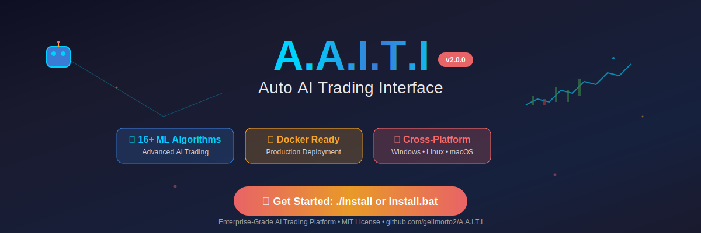

# A.A.I.T.I - Auto AI Trading Interface



**A.A.I.T.I** is an open-source cryptocurrency trading platform designed for research, education, and algorithmic trading development. Built with modern web technologies and Docker-first architecture, it provides a comprehensive suite of machine learning algorithms, technical indicators, and portfolio optimization tools.

📖 **[View Presentation](presentation.html)** | 🚀 **[Quick Start](#quick-installation)** | 📚 **[Documentation](docs/)**

## 🎯 Overview

A.A.I.T.I is designed for:
- **Educational Use**: Learn algorithmic trading concepts and machine learning in finance
- **Research**: Experiment with trading strategies and ML algorithms
- **Development**: Build and test custom trading algorithms
- **Portfolio Analysis**: Advanced portfolio optimization and risk management

⚠️ **Important**: This platform is for educational and research purposes only. It does not provide financial advice and is not intended for live trading with real money.

## ✨ Key Features

### 🧠 Machine Learning Suite
- **Neural Networks**: LSTM implementations for time series prediction
- **Ensemble Methods**: Random Forest, Gradient Boosting
- **Statistical Models**: ARIMA, SARIMA for time series analysis
- **Support Vector Machines**: Classification and regression models
- **Technical Indicators**: RSI, MACD, Bollinger Bands, and more

### 📊 Market Data & Visualization
- **Real-time Data**: Live cryptocurrency prices via CoinGecko API (provenance flagged when synthetic/mock)
- **Historical Loader**: Timeframe-aware historical fetch on chart interval changes
- **Dedicated Charts Page**: Full-screen multi-timeframe chart separate from dashboard
- **Dashboard Mini Chart**: Quick-glance price action widget
- **Pluggable Sources**: Architecture ready for exchange OHLC adapters

### 💼 Portfolio Optimization
- **Modern Portfolio Theory**: Sharpe ratio optimization
- **Risk Parity**: Equal risk contribution portfolios
- **Black-Litterman Model**: Bayesian approach to portfolio optimization
- **Hierarchical Risk Parity**: Tree-based diversification
- **Performance Metrics**: Comprehensive risk and return analysis

### 🔬 Backtesting Engine
- **Strategy Testing**: Validate trading strategies with historical data
- **Performance Metrics**: Sharpe ratio, drawdown, win rate analysis
- **Risk Analysis**: Value at Risk (VaR) and risk-adjusted returns
- **Visualization**: Equity curves and performance charts

### 🏗️ Modern Architecture & Reliability
- **Docker-First**: One-command production bootstrap
- **Role & Governance**: First user auto-admin + admin panel (promote/demote/reset)
- **Destructive Reset**: Admin can wipe accounts+credentials; onboarding reappears
- **REST API**: Idempotent trade execution & data provenance tags
- **Real-time**: Socket.io streaming + weighted health scoring
- **Security & Risk**: JWT auth, rate limiting, risk gating (position size/daily loss)

## 🚀 Quick Installation

### Prerequisites
- Docker 20.0+ with Docker Compose
- 4GB RAM (recommended)
- 2GB disk space
- Internet connection for market data

### One-Command Setup

```bash
git clone https://github.com/gelimorto2/A.A.I.T.I.git
cd A.A.I.T.I
./install
```

The installation script will:
1. Check system requirements
2. Build Docker containers
3. Start all services
4. Open the platform at http://localhost:5000

### Manual Setup (Development)

```bash
# Clone repository
git clone https://github.com/gelimorto2/A.A.I.T.I.git
cd A.A.I.T.I

# Install dependencies
npm install

# Setup environment
cp .env.template .env

# Start backend
cd backend && npm start &

# Start frontend
cd frontend && npm start
```

## 📖 Usage

### Basic Workflow

1. **Install**: Run `./install` (Docker build + start)
2. **Onboard**: If no users exist you get the Welcome Setup Wizard
3. **Create Account**: First registered user auto-elevated to Administrator
4. **Customize Dashboard**: Edit mode → drag/resize/toggle widgets (Agents, PnL, Win Rate, Health, Heat Map, Clocks, Mini Chart)
5. **Deep Charts**: Use new Charts page for large timeframe analysis (auto-loads history on change)
6. **Paper Trade**: Execute trades; transparency via mode & provenance columns
7. **Admin Tools**: Promote/demote users or perform a system reset
8. **Iterate & Improve**: Refine strategies, observe health, adjust risk

### API Examples

#### Get Market Data
```javascript
// GET /api/market/price/{symbol}
const response = await fetch('/api/market/price/bitcoin');
const data = await response.json();
console.log(data); // Current Bitcoin price
```

#### Create ML Model
```javascript
// POST /api/ml/models
const model = {
  name: "BTC Price Prediction",
  algorithm: "lstm",
  symbol: "bitcoin",
  parameters: {
    epochs: 100,
    batchSize: 32
  }
};
```

#### Optimize Portfolio
```javascript
// POST /api/portfolio/optimize
const portfolio = {
  symbols: ["bitcoin", "ethereum", "cardano"],
  method: "sharpe_ratio",
  constraints: {
    minWeight: 0.1,
    maxWeight: 0.5
  }
};
```

## 🧪 Machine Learning Algorithms

### Technical Indicators (12)
1. Linear Regression with trend analysis
2. Polynomial Regression for non-linear patterns
3. Moving Average strategies (SMA, EMA)
4. Relative Strength Index (RSI)
5. Bollinger Bands with statistical analysis
6. MACD (Moving Average Convergence Divergence)
7. Stochastic Oscillator
8. Williams %R momentum indicator
9. Fibonacci Retracement levels
10. Support and Resistance detection
11. VWAP (Volume Weighted Average Price)
12. Momentum-based strategies

### Advanced ML Models (10+)
1. **LSTM Neural Networks**: Time series prediction with TensorFlow
2. **Random Forest**: Ensemble learning for price prediction
3. **Support Vector Machines**: Classification and regression
4. **Gradient Boosting**: Advanced ensemble methods
5. **ARIMA Models**: Statistical time series forecasting
6. **SARIMA Models**: Seasonal time series analysis
7. **Prophet**: Facebook's forecasting algorithm
8. **Ensemble Strategies**: Combined model predictions
9. **Kalman Filter**: State estimation and noise reduction
10. **Adaptive Moving Averages**: Dynamic parameter adjustment

## 🔧 Project Structure

```
A.A.I.T.I/
├── backend/                    # Node.js API server
│   ├── routes/                # API endpoints
│   ├── utils/                 # ML algorithms and utilities
│   │   ├── advancedMLService.js
│   │   ├── portfolioOptimizer.js
│   │   └── technicalIndicators.js
│   └── config/                # Configuration files
├── frontend/                  # React dashboard
├── docs/                      # Documentation
├── docker/                    # Docker configurations
├── Dockerfile                 # Production container
├── docker-compose.yml         # Service orchestration
└── install                    # Installation script
```

## 📚 Documentation

- **[Installation Guide](docs/installation.md)** - Detailed setup instructions
- **[API Reference](docs/api-reference.md)** - Complete API documentation
- **[ML Algorithms](docs/ml-algorithms.md)** - Algorithm implementations
- **[Portfolio Optimization](docs/portfolio.md)** - Optimization methods
- **[Development Guide](docs/development.md)** - Contributing guidelines

## 🛠️ Technology Stack

- **Backend**: Node.js, Express, SQLite
- **Frontend**: React, Material-UI, Chart.js
- **ML Libraries**: TensorFlow.js, ml-random-forest, ARIMA
- **Database**: SQLite with migration support
- **Deployment**: Docker, Docker Compose
- **APIs**: CoinGecko for market data
- **Real-time**: Socket.io for live updates

## �️ Dashboard Widgets (Adaptive)

| Widget | Purpose | Adaptive Behavior |
|--------|---------|-------------------|
| AI Agents Status | Running / stopped / error counts | Larger: highlights failing agents |
| Profit & Loss | Aggregate PnL & trades | Larger: expanded breakdown (future: per-symbol) |
| Win Rate | Current win ratio | Larger: trend sparkline (planned) |
| System Health | Weighted backend health | Larger: subsystem metrics (latency, risk, data) |
| Market Heat Map | Relative market performance | Wider: more assets rendered |
| Enhanced Chart | Mini timeframe chart | Larger: more bars + overlays (extensible) |
| World Clocks | Global trading session times | Larger: additional time zones |
| (Charts Page) | Full analysis canvas | Independent of grid layout |

Adaptive logic progressively reveals richer context when widget area exceeds thresholds; compact mode keeps essentials visible for comfort and clarity.

## �📊 Performance & Monitoring

### Health Checks
```bash
# Check system status
docker compose ps

# View application logs
docker compose logs -f aaiti

# Health endpoint
curl http://localhost:5000/api/health
```

### Management Commands
```bash
# Restart services
docker compose restart

# Update platform
git pull && docker compose build && docker compose up -d

# Stop platform
docker compose down
```

## ⚠️ Legal Disclaimer

- **Educational Purpose**: This software is designed for educational and research use only
- **No Financial Advice**: This platform does not provide investment or financial advice
- **Risk Warning**: Cryptocurrency trading involves significant financial risk
- **Paper Trading**: Default configuration uses simulated trading only
- **Open Source**: Released under ISC License for educational use

## 🤝 Contributing

We welcome contributions! Please read our [Contributing Guide](docs/contributing.md) for details on:
- Code of conduct
- Development setup
- Pull request process
- Issue reporting

### Quick Contribution Setup
```bash
# Fork and clone the repository
git clone https://github.com/yourusername/A.A.I.T.I.git
cd A.A.I.T.I

# Create development environment
npm run dev:setup

# Run tests
npm test

# Submit pull request
```

## 📄 License

This project is licensed under the ISC License - see the [LICENSE](LICENSE) file for details.

## 🔗 Links

- **GitHub Repository**: https://github.com/gelimorto2/A.A.I.T.I
- **Issue Tracker**: https://github.com/gelimorto2/A.A.I.T.I/issues
- **Discussions**: https://github.com/gelimorto2/A.A.I.T.I/discussions
- **Releases**: https://github.com/gelimorto2/A.A.I.T.I/releases

## 🎯 Roadmap (Snapshot)

Current focus:
- Replace synthetic OHLC with real aggregated exchange candles
- Add indicators (RSI, MACD overlays) to Charts page
- Persist dashboard layouts per-user server-side (not just localStorage)
- Extend risk engine: slippage, commissions, drawdown guard
- Automated tests for onboarding/reset/role transitions

Full list: see [TODO-ROADMAP.md](TODO-ROADMAP.md)

---

**Built with ❤️ for the algorithmic trading and machine learning community**

*Educational platform for learning algorithmic trading and machine learning in finance*