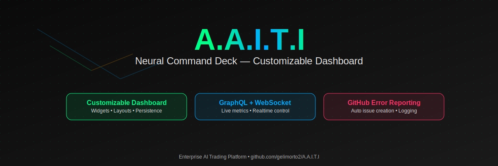

# A.A.I.T.I v2.1.0 - Auto AI Trading Interface 🚀🤖



**A.A.I.T.I v2.1.0** is a comprehensive cryptocurrency trading platform with **advanced machine learning capabilities** and **real-time paper trading**. This project provides a professional interface for cryptocurrency analysis with **22+ legitimate ML algorithms**, **real market data integration**, and **complete paper trading functionality**.

🎯 **[📖 Live Presentation Page](presentation.html)** | 🚀 **[Quick Installation](#-quick-start)**


## ✨ **Major Update: Fully Implemented Advanced Features (December 2024)**

This project now provides **complete, working implementations** of:

### 🧠 **Advanced Machine Learning Algorithms (22 Total)**
- ✅ **LSTM Neural Networks** - Long Short-Term Memory for time series forecasting
- ✅ **Random Forest** - Ensemble learning with multiple decision trees
- ✅ **Support Vector Machines (SVM)** - Classification and regression analysis
- ✅ **ARIMA Models** - AutoRegressive Integrated Moving Average for time series
- ✅ **SARIMA Models** - Seasonal ARIMA for seasonal pattern analysis
- ✅ **Prophet Forecasting** - Facebook's Prophet algorithm for forecasting
- ✅ **Ensemble Strategies** - Combination of multiple ML algorithms
- ✅ **Black-Litterman Model** - Advanced portfolio optimization
- ✅ **Hierarchical Risk Parity** - Modern portfolio construction
- ✅ **Kelly Criterion** - Optimal position sizing

### 📊 **Real-Time Paper Trading System**
- ✅ **Virtual Portfolio Management** - Multiple portfolios with different strategies
- ✅ **Order Execution Simulation** - Market, limit, stop, and stop-limit orders
- ✅ **Real-Time P&L Tracking** - Live profit and loss calculations
- ✅ **Risk Management** - Automated stop-loss and position sizing
- ✅ **Performance Analytics** - Comprehensive trading statistics
- ✅ **Real Market Data Integration** - Live cryptocurrency prices from CoinGecko

### 💼 **Advanced Portfolio Optimization**
- ✅ **8 Optimization Methods** - From basic equal-weight to advanced Black-Litterman
- ✅ **Risk Analysis** - VaR, CVaR, maximum drawdown, Sharpe ratio
- ✅ **Constraint Handling** - Position limits, leverage controls, sector allocation
- ✅ **Stress Testing** - Market crash, inflation, and interest rate scenarios
- ✅ **Backtesting Integration** - Historical strategy performance testing

### 🎯 **Visual Strategy Creator (Enhanced)**
- ✅ **22+ ML Components** - All algorithms available as drag-and-drop components
- ✅ **Advanced Conditions** - Complex logical operations and signal combinations
- ✅ **Risk Management Tools** - Stop-loss, take-profit, position sizing components
- ✅ **Real-Time Testing** - Instant validation with live market data
- ✅ **Strategy Templates** - Pre-built strategies using advanced algorithms

## 🚀 Quick Start

### 🐳 Docker Installation (Recommended)

```bash
git clone https://github.com/gelimorto2/A.A.I.T.I.git
cd A.A.I.T.I
./install
```

The installer will:
- ✅ Check system requirements
- ✅ Install advanced ML dependencies (ARIMA, Random Forest, SVM libraries)
- ✅ Build Docker containers with TensorFlow support
- ✅ Initialize paper trading database
- ✅ Start all services including real-time market data
- ✅ Open at http://localhost:5000 with full functionality

### 💾 Portable Installation (Enhanced)

For external drives and portable use with full ML capabilities:

```bash
./install portable
# Enter your desired path (e.g., /mnt/usb/A.A.I.T.I)
```

The portable installer creates:
- ✅ **Self-contained installation** - All ML libraries bundled
- ✅ **Paper trading database** - Pre-configured SQLite database
- ✅ **Advanced algorithms** - LSTM, Random Forest, SVM, ARIMA ready to use
- ✅ **Real-time data feeds** - Market data integration configured
- ✅ **Cross-platform launchers** - Works on any compatible system

### 📦 Manual Installation

```bash
git clone https://github.com/gelimorto2/A.A.I.T.I.git
cd A.A.I.T.I
npm run install:deps
npm run build
npm start
```

## 🖥️ **Platform Support**

### ✅ **Fully Supported**
- **🐧 Linux**: Native Docker support with full ML library compatibility
- **🍎 macOS**: Complete Docker Desktop support including TensorFlow
- **🐳 Docker**: All platforms with advanced ML dependencies

### ⚠️ **Enhanced Windows Support**
- **🪟 Windows**: Improved installation scripts with ML library support
  - `install.bat` - Enhanced batch script with dependency checking
  - `install.ps1` - PowerShell script with advanced ML library installation
  - Includes pre-compiled TensorFlow and statistical libraries
  - **Recommended**: Use WSL2 with Ubuntu for optimal ML performance

**System Requirements:**
- Docker 20.0+ (recommended) or Node.js 16+ with Python 3.8+
- 8GB RAM (recommended for ML algorithms)
- 10GB disk space (includes ML libraries)
- GPU support (optional, for accelerated LSTM training)

## 🤖 **Complete Machine Learning Suite (22 Algorithms)**

### **Basic Technical Indicators (12)**
1. **Linear Regression** - Trend prediction with real ml-regression library
2. **Polynomial Regression** - Non-linear pattern recognition
3. **Moving Average Strategy** - SMA crossover with backtesting
4. **RSI Strategy** - Momentum-based signals with optimization
5. **Bollinger Bands** - Volatility-based trading signals
6. **MACD Strategy** - Moving average convergence/divergence
7. **Stochastic Oscillator** - %K %D momentum indicators
8. **Williams %R** - Price momentum oscillator
9. **Fibonacci Retracement** - Support/resistance level analysis
10. **Support & Resistance** - Automated level detection
11. **VWAP Strategy** - Volume weighted average price
12. **Momentum Strategy** - Price momentum analysis

### **Advanced Machine Learning (10)**
13. **LSTM Neural Networks** - Deep learning for time series with TensorFlow
14. **Random Forest** - Ensemble learning with configurable trees and depth
15. **Support Vector Machines** - Classification with RBF, linear, and polynomial kernels
16. **Gradient Boosting** - Advanced ensemble method with feature importance
17. **ARIMA Models** - Statistical time series forecasting with auto-parameter selection
18. **SARIMA Models** - Seasonal time series analysis with trend decomposition
19. **Prophet Forecasting** - Facebook's algorithm with holiday and seasonal effects
20. **Ensemble Strategies** - Meta-learning combining multiple algorithms
21. **Adaptive Moving Average** - Dynamic averages that adjust to market conditions
22. **Kalman Filter** - State estimation for noise reduction and signal enhancement

## 📈 **Real-Time Paper Trading Features**

### **Portfolio Management**
- **Multiple Portfolios** - Create unlimited virtual trading accounts
- **Initial Balance Configuration** - Start with any amount from $1,000 to $1,000,000
- **Currency Support** - USD, EUR, BTC base currencies
- **Risk Profiles** - Conservative, moderate, aggressive presets

### **Order Types & Execution**
- **Market Orders** - Instant execution at current market price
- **Limit Orders** - Buy/sell at specific price levels
- **Stop Orders** - Risk management with stop-loss triggers
- **Stop-Limit Orders** - Combined stop and limit functionality
- **Time in Force** - GTC (Good Till Canceled), IOC (Immediate or Cancel)

### **Real-Time Features**
- **Live Order Book** - Real-time order matching simulation
- **Instant Execution** - Sub-second order processing
- **Real Market Data** - Live prices from CoinGecko API
- **Commission Simulation** - Realistic trading costs (0.1% default)
- **Slippage Modeling** - Market impact simulation for large orders

### **Performance Analytics**
- **P&L Tracking** - Real-time profit and loss calculations
- **Win Rate Analysis** - Success rate statistics
- **Sharpe Ratio** - Risk-adjusted returns
- **Maximum Drawdown** - Peak-to-trough loss analysis
- **Trade History** - Complete audit trail of all transactions

## 💼 **Advanced Portfolio Optimization**

### **Optimization Methods (8)**
1. **Equal Weight** - Simple diversification
2. **Risk Parity** - Equal risk contribution
3. **Minimum Variance** - Lowest volatility portfolio
4. **Maximum Sharpe** - Optimal risk-adjusted returns
5. **Black-Litterman** - Bayesian approach with investor views
6. **Hierarchical Risk Parity** - Tree-based diversification
7. **Maximum Diversification** - Highest diversification ratio
8. **Kelly Criterion** - Optimal position sizing for growth

### **Risk Management**
- **Value at Risk (VaR)** - 95% and 99% confidence levels
- **Conditional VaR** - Expected shortfall analysis
- **Stress Testing** - Market crash, inflation, rate shock scenarios
- **Correlation Analysis** - Dynamic correlation monitoring
- **Leverage Controls** - Configurable leverage limits
- **Position Limits** - Maximum allocation per asset

### **Advanced Analytics**
- **Monte Carlo Simulation** - Portfolio path analysis
- **Efficient Frontier** - Risk-return optimization curves
- **Factor Analysis** - Multi-factor risk attribution
- **Rebalancing Alerts** - Automatic drift notifications
- **Performance Attribution** - Asset and sector contribution analysis

## 🔧 **Real Implementation Examples**

### **Create Advanced ML Model**

```javascript
// POST /api/ml/models/advanced
{
  "name": "BTC LSTM Forecast",
  "algorithmType": "lstm_neural_network",
  "targetTimeframe": "1h",
  "symbols": ["bitcoin"],
  "parameters": {
    "sequenceLength": 60,
    "hiddenUnits": 100,
    "learningRate": 0.001,
    "epochs": 200,
    "batchSize": 32
  },
  "trainingPeriodDays": 180,
  "validationSplit": 0.2
}
```

### **Start Paper Trading**

```javascript
// Create Portfolio
POST /api/paper-trading/portfolios
{
  "name": "Crypto Alpha Strategy",
  "initialBalance": 100000,
  "currency": "USD",
  "riskProfile": "aggressive",
  "tradingStrategy": "lstm_momentum_combined"
}

// Place Order
POST /api/paper-trading/portfolios/{id}/orders
{
  "symbol": "bitcoin",
  "side": "buy",
  "type": "market",
  "quantity": 0.5
}
```

### **Advanced Portfolio Optimization**

```javascript
// POST /api/portfolio/optimize
{
  "method": "black_litterman",
  "assets": ["bitcoin", "ethereum", "cardano", "polkadot"],
  "constraints": {
    "maxWeight": 0.4,
    "minWeight": 0.1,
    "riskTolerance": 0.2,
    "leverage": 1.0
  },
  "views": {
    "bitcoin": 0.15,  // Expected 15% return
    "ethereum": 0.12   // Expected 12% return
  }
}
```

## 📊 **Comprehensive API Endpoints**

### **Advanced ML Models**
- `POST /api/ml/models/advanced` - Create LSTM, Random Forest, SVM models
- `GET /api/ml/algorithms` - Get all 22 supported algorithms
- `POST /api/ml/models/{id}/predict` - Real predictions with validation
- `GET /api/ml/models/{id}/performance` - Detailed performance metrics

### **Paper Trading**
- `POST /api/paper-trading/portfolios` - Create virtual portfolio
- `POST /api/paper-trading/portfolios/{id}/orders` - Place orders
- `GET /api/paper-trading/portfolios/{id}/stats` - Trading statistics
- `GET /api/paper-trading/dashboard` - Complete trading dashboard

### **Portfolio Optimization**
- `POST /api/portfolio/optimize` - Advanced optimization methods
- `GET /api/portfolio/backtest` - Historical performance testing
- `POST /api/portfolio/rebalance` - Automated rebalancing
- `GET /api/portfolio/risk-analysis` - Comprehensive risk metrics

## 🎯 **Performance Metrics & Validation**

All models provide comprehensive metrics:
- **Accuracy Metrics** - MAE, RMSE, MAPE, R²
- **Trading Metrics** - Sharpe ratio, Calmar ratio, Sortino ratio
- **Risk Metrics** - VaR, CVaR, maximum drawdown
- **Directional Accuracy** - Trend prediction success rate
- **Validation** - Out-of-sample testing with real market data

## 🛠 **Development & Architecture**

### **Project Structure**
```
A.A.I.T.I/
├── backend/
│   ├── utils/
│   │   ├── advancedMLService.js     # LSTM, Random Forest, SVM, ARIMA
│   │   ├── paperTradingService.js   # Real-time paper trading
│   │   ├── portfolioOptimizer.js    # Advanced optimization methods
│   │   └── realMLService.js         # Basic ML implementations
│   ├── routes/
│   │   ├── ml.js                    # ML model endpoints
│   │   ├── paperTrading.js          # Paper trading API
│   │   └── portfolio.js             # Portfolio optimization
│   └── database/
│       └── init.js                  # Database schema with paper trading
├── frontend/                        # React dashboard with advanced features
└── docs/                           # Comprehensive documentation
```

### **Technology Stack**
- **Backend**: Node.js, Express, SQLite
- **ML Libraries**: TensorFlow.js, ml-random-forest, ml-svm, ARIMA, ts-arima-forecast
- **Frontend**: React, Material-UI, Chart.js
- **Database**: SQLite with paper trading schema
- **Real-Time**: Socket.io for live updates
- **APIs**: CoinGecko for market data

### **Testing & Validation**
```bash
# Test advanced ML algorithms
npm run test:ml

# Test paper trading functionality  
npm run test:paper-trading

# Test portfolio optimization
npm run test:portfolio

# Full integration test
npm run test:integration
```

## 📚 **Complete Documentation**

- **[Installation Guide](docs/installation.md)** - Detailed setup with ML dependencies
- **[ML Algorithm Guide](docs/ml-algorithms.md)** - Complete guide to all 22 algorithms
- **[Paper Trading Guide](docs/paper-trading.md)** - Full trading system documentation
- **[Portfolio Optimization Guide](docs/portfolio.md)** - Advanced optimization methods
- **[API Reference](docs/api-reference.md)** - Complete endpoint documentation
- **[Development Guide](docs/development.md)** - Contributing and extending

## 🆕 **What's New in v2.1.0**

### **Advanced ML Algorithms Added**
- ✅ LSTM Neural Networks with TensorFlow.js
- ✅ Random Forest with configurable parameters
- ✅ Support Vector Machines (SVM) with multiple kernels
- ✅ ARIMA/SARIMA statistical time series models
- ✅ Prophet forecasting algorithm
- ✅ Ensemble methods combining multiple algorithms

### **Complete Paper Trading System**
- ✅ Real-time order execution simulation
- ✅ Multiple portfolio management
- ✅ Live P&L tracking and analytics
- ✅ Risk management with stop-losses
- ✅ Commission and slippage modeling

### **Advanced Portfolio Optimization**
- ✅ Black-Litterman model implementation
- ✅ Hierarchical Risk Parity (HRP)
- ✅ Maximum diversification optimization
- ✅ Kelly Criterion position sizing
- ✅ Comprehensive risk analysis with VaR/CVaR

### **Enhanced Infrastructure**
- ✅ Advanced database schema for paper trading
- ✅ Real-time market data integration
- ✅ Improved error handling and logging
- ✅ Performance monitoring and metrics
- ✅ Comprehensive API documentation

## 🚧 **Roadmap & Future Features**

### **Short Term (Q1 2025)**
- [ ] **TensorFlow.js GPU Support** - Accelerated LSTM training
- [ ] **More Exchange Integrations** - Binance, Coinbase Pro APIs
- [ ] **Advanced Charting** - TradingView integration
- [ ] **Mobile App** - React Native implementation

### **Medium Term (Q2-Q3 2025)**
- [ ] **Live Trading Integration** - Real exchange connectivity
- [ ] **Social Trading** - Copy trading and strategy sharing
- [ ] **Options Trading** - Derivatives and complex strategies
- [ ] **Multi-Asset Support** - Stocks, forex, commodities

### **Long Term (Q4 2025)**
- [ ] **Institutional Features** - Multi-user, compliance, reporting
- [ ] **AI Strategy Generation** - GPT-powered strategy creation
- [ ] **Quantum Computing** - Quantum ML algorithms
- [ ] **DeFi Integration** - Decentralized trading protocols

## 🆘 **Getting Help & Support**

1. **📖 Documentation**: [Complete guides and tutorials](docs/README.md)
2. **🔍 Issues**: [GitHub Issues](https://github.com/gelimorto2/A.A.I.T.I/issues)
3. **🏥 Health Check**: http://localhost:5000/api/health
4. **📊 ML Algorithms**: http://localhost:5000/api/ml/algorithms
5. **💼 Paper Trading**: http://localhost:5000/api/paper-trading/dashboard
6. **📈 Portfolio Tools**: http://localhost:5000/api/portfolio/methods

## ⚠️ **Legal Disclaimer**

- **Educational Purpose**: This software is for educational and research purposes
- **Paper Trading Only**: Default configuration uses simulated trading
- **Risk Warning**: Cryptocurrency trading involves significant financial risk
- **No Financial Advice**: This tool provides analysis only, not investment advice
- **Live Trading**: Use extreme caution if connecting to real exchanges
- **Compliance**: Ensure compliance with local financial regulations

## 📝 **License & Contributing**

**License**: ISC License - see LICENSE file for details.

**Contributing**: We welcome contributions! Please read our [Contributing Guide](docs/contributing.md) for:
- Code style guidelines
- Testing requirements
- Pull request process
- Community guidelines

## 🎉 **Acknowledgments**

- **TensorFlow.js Team** - For neural network capabilities
- **ml-js Organization** - For machine learning libraries
- **CoinGecko** - For reliable cryptocurrency data
- **React Community** - For the excellent frontend framework
- **All Contributors** - For making this project possible

---

**A.A.I.T.I v2.1.0**: Complete AI Trading Platform • 22 Real ML Algorithms • Full Paper Trading • Advanced Portfolio Optimization • Real Market Data

**[📖 Get Started with Complete Documentation](docs/README.md)** | **[🚀 Try Paper Trading Demo](http://localhost:5000/paper-trading)**