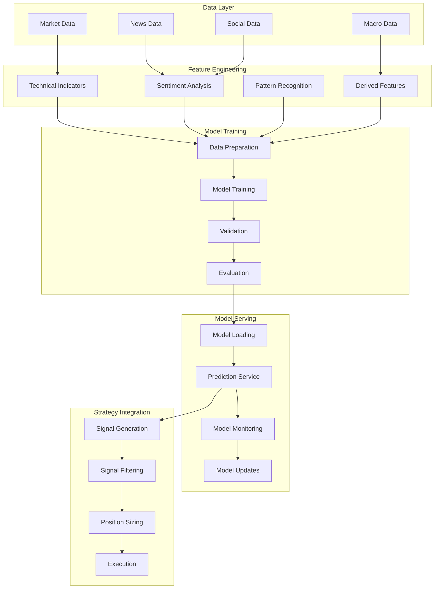
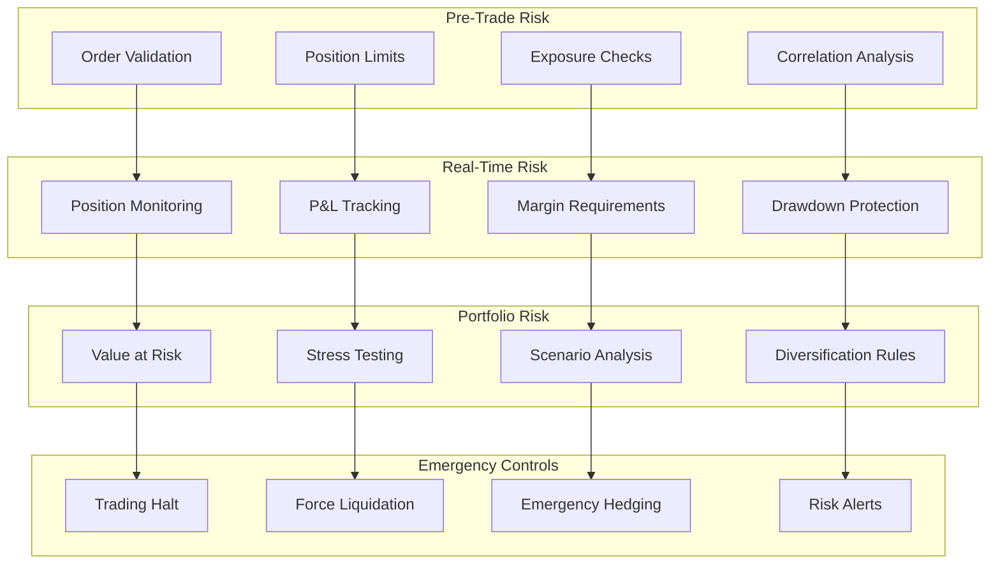

# A.A.I.T.I ML Models & Risk Management Specification
**Machine Learning Models and Risk Management Framework - Technical Specification**

Version: 2.0.0 | Last Updated: December 2024

## ⚠️ IMPORTANT DISCLAIMERS

### Financial Risk Disclaimer
**TRADING INVOLVES SUBSTANTIAL RISK OF LOSS AND IS NOT SUITABLE FOR ALL INVESTORS.**

- Past performance is not indicative of future results
- Cryptocurrency trading is highly volatile and speculative
- You may lose all or more than your initial investment
- Only trade with capital you can afford to lose completely
- Seek professional financial advice before making investment decisions

### ML Model Disclaimer
**MACHINE LEARNING MODELS ARE PROBABILISTIC AND NOT GUARANTEED TO BE ACCURATE.**

- Models are trained on historical data which may not predict future performance
- Market conditions can change rapidly, making models obsolete
- Model predictions should not be the sole basis for trading decisions
- Human oversight and risk management are essential
- Regular model retraining and validation are required

### Software Disclaimer
**THIS SOFTWARE IS PROVIDED "AS IS" WITHOUT WARRANTY OF ANY KIND.**

- No guarantee of system availability, accuracy, or performance
- Users are responsible for testing and validation in their environment
- The authors are not liable for any financial losses
- This is educational/research software, not professional trading advice

## 🧠 Machine Learning Architecture

### ML Pipeline Overview


## 🔮 ML Model Specifications

### 1. Price Prediction Model

#### Model Architecture
```javascript
// TensorFlow.js Sequential Model
const priceModel = tf.sequential({
  layers: [
    // Input layer: 60 timesteps x 50 features
    tf.layers.lstm({
      units: 128,
      returnSequences: true,
      inputShape: [60, 50],
      dropout: 0.2,
      recurrentDropout: 0.2
    }),
    
    // Second LSTM layer
    tf.layers.lstm({
      units: 64,
      returnSequences: false,
      dropout: 0.2,
      recurrentDropout: 0.2
    }),
    
    // Dense layers with batch normalization
    tf.layers.dense({units: 32, activation: 'relu'}),
    tf.layers.batchNormalization(),
    tf.layers.dropout({rate: 0.3}),
    
    tf.layers.dense({units: 16, activation: 'relu'}),
    tf.layers.dropout({rate: 0.2}),
    
    // Output layer: price change prediction
    tf.layers.dense({units: 1, activation: 'tanh'}) // [-1, 1] range
  ]
});
```

#### Training Configuration
```javascript
const trainingConfig = {
  optimizer: tf.train.adam(0.001),
  loss: 'meanSquaredError',
  metrics: ['mae', 'mse'],
  
  // Training parameters
  epochs: 100,
  batchSize: 32,
  validationSplit: 0.2,
  
  // Early stopping
  callbacks: [
    tf.callbacks.earlyStopping({
      monitor: 'val_loss',
      patience: 10,
      restoreBestWeights: true
    })
  ]
};
```

#### Feature Engineering
```javascript
const features = {
  // Technical indicators (20 features)
  technical: [
    'rsi_14', 'rsi_30',           // Momentum
    'macd', 'macd_signal',        // Trend
    'bb_upper', 'bb_lower',       // Volatility
    'sma_10', 'sma_20', 'sma_50', // Moving averages
    'ema_12', 'ema_26',           // Exponential MA
    'volume_sma_20',              // Volume
    'atr_14',                     // Volatility
    'stoch_k', 'stoch_d',         // Stochastic
    'williams_r',                 // Williams %R
    'cci_20',                     // Commodity Channel Index
    'adx_14',                     // Trend strength
    'obv'                         // On-Balance Volume
  ],
  
  // Price-based features (15 features)
  price: [
    'price_change_1h', 'price_change_4h', 'price_change_24h',
    'price_volatility_24h', 'price_volatility_7d',
    'high_low_ratio', 'close_open_ratio',
    'volume_change_24h', 'volume_ratio_sma',
    'support_level', 'resistance_level',
    'fibonacci_retracement', 'pivot_point',
    'daily_range', 'intraday_momentum'
  ],
  
  // Market structure features (10 features)
  market: [
    'market_cap_rank', 'dominance_btc',
    'correlation_btc', 'correlation_eth',
    'relative_strength_index', 'sector_performance',
    'fear_greed_index', 'funding_rate',
    'open_interest_change', 'liquidation_ratio'
  ],
  
  // Sentiment features (5 features)  
  sentiment: [
    'news_sentiment_score',
    'social_sentiment_score',
    'reddit_mentions',
    'twitter_sentiment',
    'google_trends'
  ]
};
```

### 2. Trend Classification Model

#### Model Architecture
```javascript
const trendModel = tf.sequential({
  layers: [
    // Convolutional layers for pattern recognition
    tf.layers.conv1d({
      filters: 64,
      kernelSize: 3,
      activation: 'relu',
      inputShape: [120, 20] // 120 timesteps, 20 features
    }),
    tf.layers.maxPooling1d({poolSize: 2}),
    tf.layers.dropout({rate: 0.25}),
    
    tf.layers.conv1d({
      filters: 32,
      kernelSize: 3,
      activation: 'relu'
    }),
    tf.layers.maxPooling1d({poolSize: 2}),
    tf.layers.dropout({rate: 0.25}),
    
    // Flatten and dense layers
    tf.layers.flatten(),
    tf.layers.dense({units: 128, activation: 'relu'}),
    tf.layers.dropout({rate: 0.5}),
    tf.layers.dense({units: 64, activation: 'relu'}),
    tf.layers.dropout({rate: 0.3}),
    
    // Multi-class output: uptrend, downtrend, sideways
    tf.layers.dense({units: 3, activation: 'softmax'})
  ]
});
```

### 3. Volatility Prediction Model

#### Model Architecture
```javascript
const volatilityModel = tf.sequential({
  layers: [
    // LSTM for sequence modeling
    tf.layers.lstm({
      units: 64,
      returnSequences: true,
      inputShape: [30, 15], // 30 timesteps, 15 volatility features
      dropout: 0.2
    }),
    
    tf.layers.lstm({
      units: 32,
      returnSequences: false,
      dropout: 0.2
    }),
    
    // Dense layers
    tf.layers.dense({units: 16, activation: 'relu'}),
    tf.layers.dropout({rate: 0.3}),
    
    // Output: volatility prediction (0-1 range)
    tf.layers.dense({units: 1, activation: 'sigmoid'})
  ]
});
```

## 📊 Model Performance Metrics

### Evaluation Framework
```javascript
const modelEvaluation = {
  // Regression metrics (price prediction)
  regression: {
    mae: 'Mean Absolute Error',
    mse: 'Mean Squared Error',
    rmse: 'Root Mean Square Error',
    mape: 'Mean Absolute Percentage Error',
    r2: 'R-squared coefficient',
    directional_accuracy: 'Direction prediction accuracy'
  },
  
  // Classification metrics (trend classification)
  classification: {
    accuracy: 'Overall classification accuracy',
    precision: 'Precision per class',
    recall: 'Recall per class',
    f1_score: 'F1 score per class',
    confusion_matrix: 'Confusion matrix',
    auc_roc: 'Area under ROC curve'
  },
  
  // Financial metrics
  financial: {
    sharpe_ratio: 'Risk-adjusted returns',
    max_drawdown: 'Maximum portfolio drawdown',
    hit_rate: 'Percentage of profitable trades',
    profit_factor: 'Gross profit / Gross loss',
    calmar_ratio: 'Annual return / Max drawdown',
    sortino_ratio: 'Downside deviation adjusted returns'
  }
};
```

### Backtesting Framework
```javascript
const backtestConfig = {
  // Test periods
  periods: {
    training: '2020-01-01 to 2023-01-01',
    validation: '2023-01-01 to 2023-07-01', 
    testing: '2023-07-01 to 2024-01-01',
    out_of_sample: '2024-01-01 to present'
  },
  
  // Trading simulation
  simulation: {
    initial_capital: 100000,
    commission: 0.001, // 0.1% per trade
    slippage: 0.0005,  // 0.05% slippage
    market_impact: 0.0002, // 0.02% market impact
    
    // Position sizing
    max_position_size: 0.05, // 5% of portfolio
    position_sizing_method: 'kelly_criterion',
    
    // Risk management
    stop_loss: 0.02,    // 2% stop loss
    take_profit: 0.04,  // 4% take profit
    max_trades_per_day: 10
  }
};
```

## 🛡️ Risk Management Framework

### Multi-Layer Risk Architecture


### 1. Position Risk Limits

#### Individual Position Limits
```javascript
const positionLimits = {
  // Maximum position size
  max_position_size: {
    percentage_of_portfolio: 0.05,  // 5% max per position
    absolute_dollar_amount: 50000,  // $50k max per position
    
    // Asset-specific limits
    btc: 0.10,    // 10% max for BTC
    eth: 0.08,    // 8% max for ETH
    altcoins: 0.03 // 3% max for altcoins
  },
  
  // Leverage limits
  max_leverage: {
    major_pairs: 3.0,     // 3x leverage for BTC/ETH
    minor_pairs: 2.0,     // 2x leverage for other top 20
    micro_caps: 1.0       // No leverage for small caps
  },
  
  // Concentration limits
  concentration: {
    single_asset: 0.15,           // 15% max in any single asset
    sector_correlation: 0.25,     // 25% max in correlated assets
    exchange_exposure: 0.40       // 40% max on any single exchange
  }
};
```

### 2. Portfolio Risk Metrics

#### Value at Risk (VaR) Calculation
```javascript
class VaRCalculator {
  constructor(confidenceLevel = 0.95, timeHorizon = 1) {
    this.confidenceLevel = confidenceLevel;
    this.timeHorizon = timeHorizon;
  }
  
  // Historical simulation VaR
  calculateHistoricalVaR(returns, portfolioValue) {
    const sortedReturns = returns.sort((a, b) => a - b);
    const varIndex = Math.floor((1 - this.confidenceLevel) * returns.length);
    const varReturn = sortedReturns[varIndex];
    
    return {
      var_dollar: portfolioValue * Math.abs(varReturn),
      var_percentage: Math.abs(varReturn) * 100,
      confidence_level: this.confidenceLevel,
      time_horizon: this.timeHorizon
    };
  }
  
  // Monte Carlo VaR simulation
  calculateMonteCarloVaR(portfolioValue, expectedReturn, volatility, simulations = 10000) {
    const returns = [];
    
    for (let i = 0; i < simulations; i++) {
      const randomReturn = this.generateRandomReturn(expectedReturn, volatility);
      returns.push(randomReturn);
    }
    
    return this.calculateHistoricalVaR(returns, portfolioValue);
  }
  
  generateRandomReturn(expectedReturn, volatility) {
    // Box-Muller transformation for normal distribution
    const u1 = Math.random();
    const u2 = Math.random();
    const z = Math.sqrt(-2 * Math.log(u1)) * Math.cos(2 * Math.PI * u2);
    
    return expectedReturn + volatility * z;
  }
}
```

### 3. Dynamic Risk Controls

#### Drawdown Protection
```javascript
class DrawdownProtection {
  constructor(maxDrawdown = 0.10, reductionFactor = 0.5) {
    this.maxDrawdown = maxDrawdown;           // 10% max drawdown
    this.reductionFactor = reductionFactor;   // 50% position reduction
    this.currentDrawdown = 0;
    this.peakValue = 0;
    this.active = false;
  }
  
  updateDrawdown(currentPortfolioValue) {
    if (currentPortfolioValue > this.peakValue) {
      this.peakValue = currentPortfolioValue;
    }
    
    this.currentDrawdown = (this.peakValue - currentPortfolioValue) / this.peakValue;
    
    // Activate protection if drawdown exceeds threshold
    if (this.currentDrawdown >= this.maxDrawdown && !this.active) {
      this.activateProtection();
    }
    
    // Deactivate protection if drawdown recovers
    if (this.currentDrawdown <= this.maxDrawdown * 0.5 && this.active) {
      this.deactivateProtection();
    }
    
    return {
      current_drawdown: this.currentDrawdown,
      max_drawdown: this.maxDrawdown,
      protection_active: this.active,
      position_scaling_factor: this.active ? this.reductionFactor : 1.0
    };
  }
  
  activateProtection() {
    this.active = true;
    console.log(`🛡️ Drawdown protection activated at ${(this.currentDrawdown * 100).toFixed(2)}%`);
    
    // Reduce position sizes
    // Send alerts
    // Log event
  }
  
  deactivateProtection() {
    this.active = false;
    console.log(`✅ Drawdown protection deactivated`);
  }
}
```

### 4. Risk Monitoring & Alerts

#### Real-Time Risk Monitoring
```javascript
class RiskMonitor {
  constructor() {
    this.riskMetrics = new Map();
    this.alertRules = new Map();
    this.setupDefaultAlerts();
  }
  
  setupDefaultAlerts() {
    // Position size alerts
    this.alertRules.set('position_size_breach', {
      condition: (metrics) => metrics.largest_position > 0.05,
      severity: 'warning',
      message: 'Position size exceeds 5% of portfolio'
    });
    
    // Drawdown alerts
    this.alertRules.set('high_drawdown', {
      condition: (metrics) => metrics.current_drawdown > 0.05,
      severity: 'critical',
      message: 'Portfolio drawdown exceeds 5%'
    });
    
    // Concentration alerts
    this.alertRules.set('concentration_risk', {
      condition: (metrics) => metrics.sector_concentration > 0.25,
      severity: 'warning',
      message: 'Sector concentration exceeds 25%'
    });
    
    // VaR alerts
    this.alertRules.set('var_breach', {
      condition: (metrics) => metrics.var_utilization > 0.80,
      severity: 'warning',
      message: 'VaR utilization exceeds 80%'
    });
  }
  
  evaluateRisk(portfolioData) {
    const metrics = this.calculateRiskMetrics(portfolioData);
    this.riskMetrics.set('current', metrics);
    
    // Check alert rules
    for (const [ruleId, rule] of this.alertRules) {
      if (rule.condition(metrics)) {
        this.triggerAlert(ruleId, rule, metrics);
      }
    }
    
    return metrics;
  }
  
  calculateRiskMetrics(portfolioData) {
    return {
      // Position metrics
      total_positions: portfolioData.positions.length,
      largest_position: Math.max(...portfolioData.positions.map(p => p.weight)),
      average_position: portfolioData.positions.reduce((sum, p) => sum + p.weight, 0) / portfolioData.positions.length,
      
      // Concentration metrics
      sector_concentration: this.calculateSectorConcentration(portfolioData.positions),
      exchange_concentration: this.calculateExchangeConcentration(portfolioData.positions),
      
      // Risk metrics
      current_drawdown: portfolioData.current_drawdown || 0,
      var_1day: portfolioData.var_1day || 0,
      var_utilization: (portfolioData.var_1day || 0) / (portfolioData.total_value * 0.02), // 2% VaR limit
      
      // Performance metrics
      sharpe_ratio: portfolioData.sharpe_ratio || 0,
      sortino_ratio: portfolioData.sortino_ratio || 0,
      
      timestamp: new Date().toISOString()
    };
  }
  
  triggerAlert(ruleId, rule, metrics) {
    const alert = {
      id: `${ruleId}_${Date.now()}`,
      rule_id: ruleId,
      severity: rule.severity,
      message: rule.message,
      metrics: metrics,
      timestamp: new Date().toISOString()
    };
    
    console.log(`🚨 Risk Alert [${rule.severity.toUpperCase()}]: ${rule.message}`);
    
    // Send to alerting system
    // Log to database
    // Notify risk managers
  }
}
```

## 🎯 Model Validation & Testing

### A/B Testing Framework
```javascript
class ModelABTesting {
  constructor() {
    this.experiments = new Map();
    this.results = new Map();
  }
  
  createExperiment(name, controlModel, treatmentModel, trafficSplit = 0.5) {
    const experiment = {
      name,
      control_model: controlModel,
      treatment_model: treatmentModel,
      traffic_split: trafficSplit,
      start_date: new Date(),
      status: 'active',
      
      // Metrics tracking
      control_metrics: {
        predictions: 0,
        accuracy: 0,
        profit: 0,
        trades: 0
      },
      treatment_metrics: {
        predictions: 0,
        accuracy: 0,
        profit: 0,
        trades: 0
      }
    };
    
    this.experiments.set(name, experiment);
    return experiment;
  }
  
  routeTraffic(experimentName) {
    const experiment = this.experiments.get(experimentName);
    if (!experiment || experiment.status !== 'active') {
      return 'control';
    }
    
    return Math.random() < experiment.traffic_split ? 'treatment' : 'control';
  }
  
  recordResult(experimentName, variant, prediction, actual, profit) {
    const experiment = this.experiments.get(experimentName);
    if (!experiment) return;
    
    const metrics = variant === 'treatment' ? 
      experiment.treatment_metrics : 
      experiment.control_metrics;
    
    metrics.predictions++;
    metrics.accuracy = this.updateMovingAverage(
      metrics.accuracy, 
      prediction === actual ? 1 : 0, 
      metrics.predictions
    );
    metrics.profit += profit;
    if (profit !== 0) metrics.trades++;
  }
  
  updateMovingAverage(currentAvg, newValue, count) {
    return (currentAvg * (count - 1) + newValue) / count;
  }
}
```

### Model Drift Detection
```javascript
class ModelDriftDetector {
  constructor(referenceWindow = 1000, detectionWindow = 100, threshold = 0.05) {
    this.referenceWindow = referenceWindow;
    this.detectionWindow = detectionWindow;
    this.threshold = threshold;
    this.referenceData = [];
    this.currentData = [];
  }
  
  addReference(features, prediction, actual) {
    this.referenceData.push({ features, prediction, actual });
    
    // Maintain sliding window
    if (this.referenceData.length > this.referenceWindow) {
      this.referenceData.shift();
    }
  }
  
  detectDrift(features, prediction, actual) {
    this.currentData.push({ features, prediction, actual });
    
    // Maintain detection window
    if (this.currentData.length > this.detectionWindow) {
      this.currentData.shift();
    }
    
    // Need sufficient data for detection
    if (this.currentData.length < this.detectionWindow || 
        this.referenceData.length < this.referenceWindow) {
      return { drift_detected: false, reason: 'insufficient_data' };
    }
    
    // Statistical tests for drift
    const tests = {
      accuracy_drift: this.testAccuracyDrift(),
      feature_drift: this.testFeatureDrift(),
      prediction_drift: this.testPredictionDrift()
    };
    
    const driftDetected = Object.values(tests).some(test => test.drift);
    
    return {
      drift_detected: driftDetected,
      tests: tests,
      timestamp: new Date().toISOString()
    };
  }
  
  testAccuracyDrift() {
    const refAccuracy = this.calculateAccuracy(this.referenceData);
    const currentAccuracy = this.calculateAccuracy(this.currentData);
    const accuracyDrop = refAccuracy - currentAccuracy;
    
    return {
      drift: accuracyDrop > this.threshold,
      reference_accuracy: refAccuracy,
      current_accuracy: currentAccuracy,
      accuracy_drop: accuracyDrop
    };
  }
  
  calculateAccuracy(data) {
    const correct = data.filter(d => 
      Math.sign(d.prediction) === Math.sign(d.actual - d.features.current_price)
    ).length;
    return correct / data.length;
  }
}
```

## 📈 Performance Optimization

### Model Serving Optimization
```javascript
class OptimizedModelServer {
  constructor() {
    this.modelCache = new Map();
    this.predictionCache = new Map();
    this.batchQueue = [];
    this.batchSize = 32;
    this.batchTimeout = 100; // ms
    
    this.setupBatchProcessing();
  }
  
  setupBatchProcessing() {
    setInterval(() => {
      if (this.batchQueue.length > 0) {
        this.processBatch();
      }
    }, this.batchTimeout);
  }
  
  async predict(modelId, features) {
    // Check cache first
    const cacheKey = this.generateCacheKey(modelId, features);
    if (this.predictionCache.has(cacheKey)) {
      return this.predictionCache.get(cacheKey);
    }
    
    // Add to batch queue
    return new Promise((resolve, reject) => {
      this.batchQueue.push({
        modelId,
        features,
        resolve,
        reject,
        timestamp: Date.now()
      });
      
      // Process immediately if batch is full
      if (this.batchQueue.length >= this.batchSize) {
        this.processBatch();
      }
    });
  }
  
  async processBatch() {
    const batch = this.batchQueue.splice(0, this.batchSize);
    
    // Group by model
    const modelBatches = new Map();
    for (const item of batch) {
      if (!modelBatches.has(item.modelId)) {
        modelBatches.set(item.modelId, []);
      }
      modelBatches.get(item.modelId).push(item);
    }
    
    // Process each model batch
    for (const [modelId, items] of modelBatches) {
      try {
        const model = await this.loadModel(modelId);
        const features = items.map(item => item.features);
        const predictions = await model.predict(tf.tensor2d(features)).data();
        
        // Resolve promises with results
        items.forEach((item, index) => {
          const prediction = predictions[index];
          
          // Cache result
          const cacheKey = this.generateCacheKey(modelId, item.features);
          this.predictionCache.set(cacheKey, prediction);
          
          item.resolve(prediction);
        });
        
      } catch (error) {
        // Reject all promises in this batch
        items.forEach(item => item.reject(error));
      }
    }
  }
  
  generateCacheKey(modelId, features) {
    return `${modelId}_${JSON.stringify(features)}`;
  }
}
```

---

**🔬 Model Development Guidelines**

1. **Data Quality**: Ensure high-quality, clean training data
2. **Feature Engineering**: Focus on relevant, non-leaky features
3. **Validation**: Use proper cross-validation and out-of-sample testing
4. **Monitoring**: Implement comprehensive model monitoring
5. **Risk Management**: Always combine ML with proper risk controls

**⚠️ Risk Management Principles**

1. **Never Risk More Than You Can Afford to Lose**
2. **Diversification is Key**: Never put all capital in one trade
3. **Use Stop Losses**: Limit downside risk on every position
4. **Monitor Drawdowns**: Implement drawdown protection
5. **Human Oversight**: ML models should assist, not replace human judgment

**🚨 Production Deployment Checklist**

- [ ] Comprehensive backtesting on multiple time periods
- [ ] Model validation on out-of-sample data
- [ ] Risk management system tested and validated  
- [ ] Performance monitoring and alerting configured
- [ ] Disaster recovery procedures documented
- [ ] Legal and compliance review completed
- [ ] Paper trading validation period completed
- [ ] Gradual capital allocation strategy defined