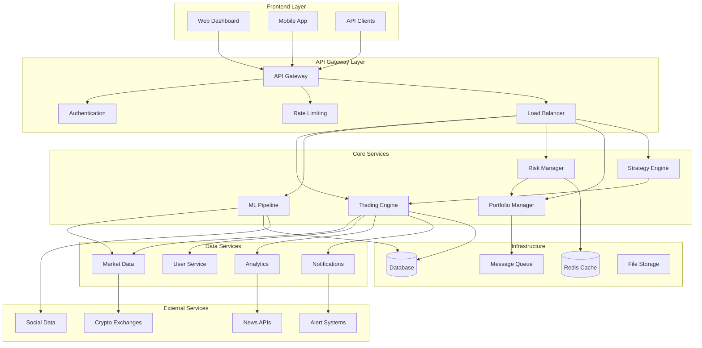
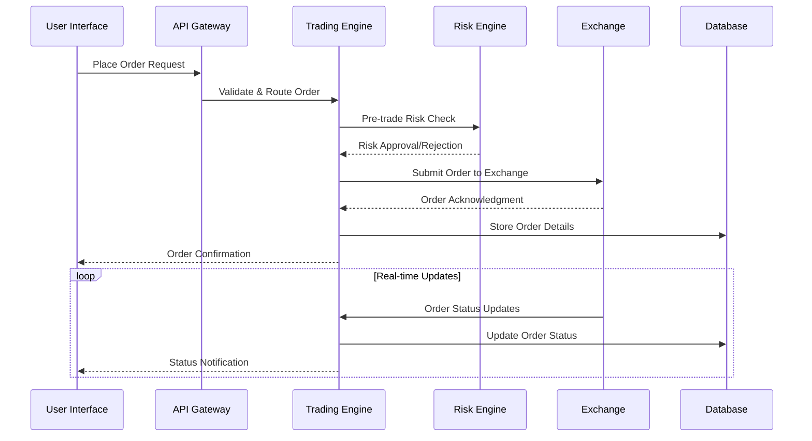
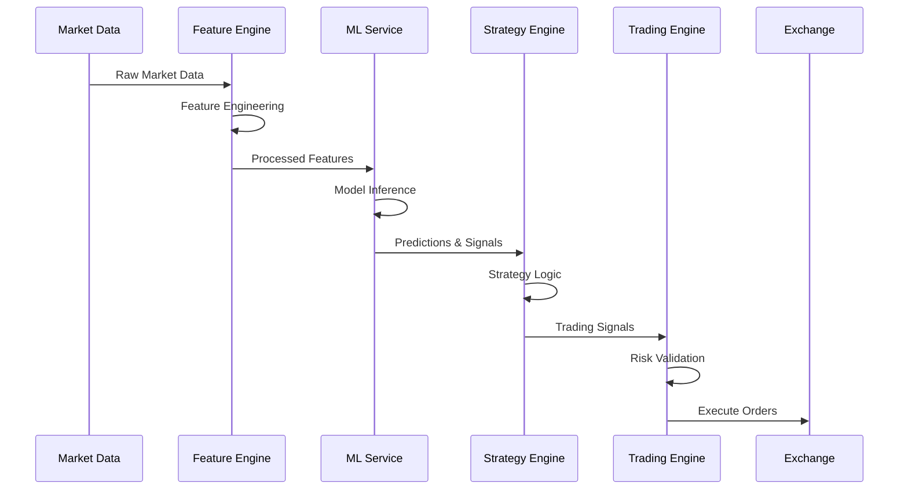
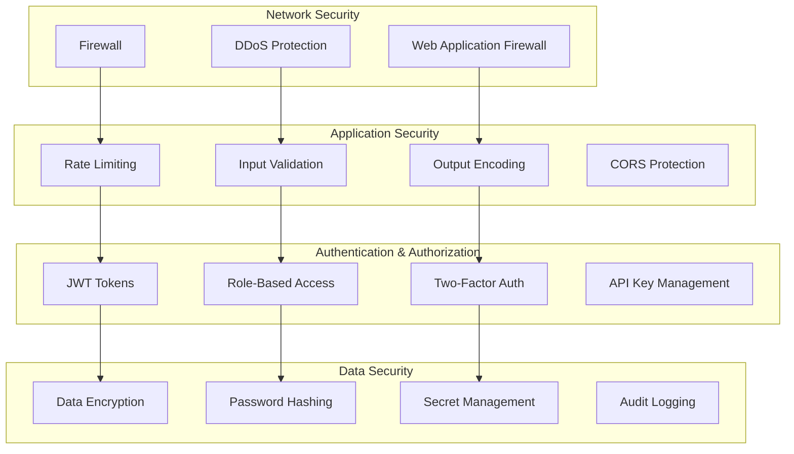

# A.A.I.T.I System Architecture
**Advanced Automated Intelligent Trading Interface - Technical Architecture Guide**

Version: 2.0.0 | Last Updated: December 2024

## 🏗️ System Overview

A.A.I.T.I is a production-grade, microservices-based trading platform that combines advanced machine learning with robust risk management to deliver automated cryptocurrency trading capabilities.

### Architecture Principles
- **Microservices**: Loosely coupled, independently deployable services
- **Event-Driven**: Asynchronous communication via message queues
- **Fault-Tolerant**: Circuit breakers, graceful degradation, chaos engineering
- **Scalable**: Horizontal scaling, load balancing, auto-scaling
- **Observable**: Comprehensive monitoring, logging, and alerting
- **Secure**: Defense in depth, encryption, authentication, authorization

## 🎯 Core System Components



## 🔧 Technology Stack

### Backend Services
- **Runtime**: Node.js 18+ with Express.js framework
- **Language**: JavaScript/TypeScript for type safety
- **Database**: SQLite (development), PostgreSQL (production)
- **Cache**: Redis for session storage and fast data access
- **Queue**: Redis-based message queuing
- **ML**: TensorFlow.js for in-process ML inference

### Frontend Application
- **Framework**: React 18 with TypeScript
- **State Management**: Redux Toolkit with RTK Query
- **UI Library**: Material-UI (MUI) with custom theming
- **Charts**: Chart.js and Recharts for data visualization
- **Real-time**: Socket.io for live updates

### Infrastructure
- **Containerization**: Docker with multi-stage builds
- **Orchestration**: Docker Compose (development), Kubernetes (production)
- **Monitoring**: Prometheus metrics, Grafana dashboards
- **Logging**: Winston with structured logging
- **Security**: Helmet.js, rate limiting, CORS, JWT authentication

### External Integrations
- **Exchanges**: Binance, Coinbase Pro, Kraken APIs
- **Market Data**: WebSocket feeds, REST APIs
- **Notifications**: Telegram, Email, SMS via Twilio
- **Cloud**: AWS/Azure/GCP for production deployment

## 🏢 Service Architecture Details

### 1. API Gateway Layer

#### API Gateway Service
```javascript
// Core responsibilities
- Route management and load balancing
- Request/response transformation
- API versioning and backwards compatibility
- Cross-cutting concerns (CORS, compression)

// Key features
- Rate limiting: 1000 req/min per user
- Request validation using Joi schemas
- Response caching for read-heavy endpoints
- Circuit breaker pattern for downstream services
```

#### Authentication Service
```javascript
// Authentication methods
- JWT tokens with 7-day expiry
- Refresh token rotation
- API key authentication for programmatic access
- 2FA using TOTP (Google Authenticator)

// Authorization
- Role-based access control (RBAC)
- Permission-based resource access
- API scope limiting
- Session management with Redis
```

### 2. Trading Engine

#### Core Trading Service
```javascript
// Order management
- Order types: Market, Limit, Stop, Stop-Limit
- Order validation and risk checks
- Execution tracking and status updates
- Partial fill handling

// Position management
- Real-time position tracking
- P&L calculation and updates
- Position sizing and leverage controls
- Cross-margin and isolated margin support

// Risk integration
- Pre-trade risk checks
- Real-time exposure monitoring
- Automatic position closing on breaches
- Emergency trading halt capabilities
```

#### Market Data Service
```javascript
// Data ingestion
- Real-time WebSocket feeds from exchanges
- Historical data backfill and storage
- Data normalization across exchanges
- Market depth (order book) management

// Data distribution
- Fan-out to multiple consumers
- Data quality checks and filtering
- Latency monitoring and optimization
- Failover to backup data sources
```

### 3. ML Pipeline

#### Model Training Service
```javascript
// Feature engineering
- Technical indicators (RSI, MACD, Bollinger Bands)
- Sentiment analysis from news and social media
- Macro-economic indicators integration
- Custom feature transformation pipelines

// Model training
- TensorFlow.js model definitions
- Hyperparameter optimization
- Cross-validation and backtesting
- Model versioning and registry
```

#### Prediction Service
```javascript
// Real-time inference
- Low-latency model serving
- Batch and streaming predictions
- Model ensemble and voting
- Prediction confidence scoring

// Model monitoring
- Drift detection and alerting
- Performance degradation tracking
- A/B testing framework
- Automated model retraining triggers
```

### 4. Risk Management

#### Risk Engine
```javascript
// Position risk
- Maximum position size limits
- Concentration risk monitoring
- Correlation-based exposure limits
- Volatility-adjusted position sizing

// Portfolio risk
- Value at Risk (VaR) calculation
- Maximum drawdown protection
- Sector/asset class diversification
- Leverage and margin requirements

// Real-time monitoring
- Risk metric updates every second
- Breach detection and alerting
- Automatic risk reduction actions
- Risk reporting and dashboards
```

## 🔄 Data Flow Architecture

### Trading Flow


### ML Prediction Flow


## 📊 Database Schema

### Core Entities
```sql
-- Users and Authentication
CREATE TABLE users (
    id SERIAL PRIMARY KEY,
    username VARCHAR(50) UNIQUE NOT NULL,
    email VARCHAR(255) UNIQUE NOT NULL,
    password_hash VARCHAR(255) NOT NULL,
    role VARCHAR(20) DEFAULT 'user',
    created_at TIMESTAMP DEFAULT CURRENT_TIMESTAMP,
    updated_at TIMESTAMP DEFAULT CURRENT_TIMESTAMP
);

-- Trading Accounts
CREATE TABLE trading_accounts (
    id SERIAL PRIMARY KEY,
    user_id INTEGER REFERENCES users(id),
    exchange VARCHAR(50) NOT NULL,
    account_type VARCHAR(20) DEFAULT 'paper', -- 'paper' or 'live'
    api_key_encrypted TEXT,
    secret_encrypted TEXT,
    balance DECIMAL(20,8) DEFAULT 0,
    created_at TIMESTAMP DEFAULT CURRENT_TIMESTAMP
);

-- Orders
CREATE TABLE orders (
    id SERIAL PRIMARY KEY,
    account_id INTEGER REFERENCES trading_accounts(id),
    symbol VARCHAR(20) NOT NULL,
    side VARCHAR(4) NOT NULL, -- 'buy' or 'sell'
    type VARCHAR(20) NOT NULL, -- 'market', 'limit', 'stop'
    quantity DECIMAL(20,8) NOT NULL,
    price DECIMAL(20,8),
    stop_price DECIMAL(20,8),
    status VARCHAR(20) DEFAULT 'pending',
    filled_quantity DECIMAL(20,8) DEFAULT 0,
    avg_fill_price DECIMAL(20,8),
    exchange_order_id VARCHAR(255),
    created_at TIMESTAMP DEFAULT CURRENT_TIMESTAMP,
    updated_at TIMESTAMP DEFAULT CURRENT_TIMESTAMP
);

-- Positions
CREATE TABLE positions (
    id SERIAL PRIMARY KEY,
    account_id INTEGER REFERENCES trading_accounts(id),
    symbol VARCHAR(20) NOT NULL,
    quantity DECIMAL(20,8) NOT NULL,
    avg_price DECIMAL(20,8) NOT NULL,
    market_value DECIMAL(20,8),
    unrealized_pnl DECIMAL(20,8),
    realized_pnl DECIMAL(20,8) DEFAULT 0,
    created_at TIMESTAMP DEFAULT CURRENT_TIMESTAMP,
    updated_at TIMESTAMP DEFAULT CURRENT_TIMESTAMP,
    UNIQUE(account_id, symbol)
);

-- ML Models
CREATE TABLE ml_models (
    id SERIAL PRIMARY KEY,
    name VARCHAR(100) NOT NULL,
    version VARCHAR(20) NOT NULL,
    model_type VARCHAR(50) NOT NULL,
    parameters JSONB,
    performance_metrics JSONB,
    file_path VARCHAR(500),
    status VARCHAR(20) DEFAULT 'active',
    created_at TIMESTAMP DEFAULT CURRENT_TIMESTAMP,
    UNIQUE(name, version)
);

-- Predictions
CREATE TABLE predictions (
    id SERIAL PRIMARY KEY,
    model_id INTEGER REFERENCES ml_models(id),
    symbol VARCHAR(20) NOT NULL,
    prediction_value DECIMAL(10,6) NOT NULL,
    confidence DECIMAL(5,4),
    features JSONB,
    actual_value DECIMAL(10,6),
    created_at TIMESTAMP DEFAULT CURRENT_TIMESTAMP
);
```

### Indexes for Performance
```sql
-- Trading performance indexes
CREATE INDEX idx_orders_account_created ON orders(account_id, created_at);
CREATE INDEX idx_orders_symbol_status ON orders(symbol, status);
CREATE INDEX idx_positions_account_symbol ON positions(account_id, symbol);

-- ML performance indexes
CREATE INDEX idx_predictions_model_symbol ON predictions(model_id, symbol);
CREATE INDEX idx_predictions_created ON predictions(created_at);

-- User activity indexes
CREATE INDEX idx_users_email ON users(email);
CREATE INDEX idx_trading_accounts_user ON trading_accounts(user_id);
```

## 🛡️ Security Architecture

### Defense in Depth


### Security Controls
- **Transport Security**: TLS 1.3, HSTS headers, certificate pinning
- **API Security**: Rate limiting, input validation, SQL injection prevention
- **Data Protection**: AES-256 encryption at rest, bcrypt password hashing
- **Access Control**: JWT with short expiry, refresh token rotation
- **Audit Trail**: Comprehensive logging of all user actions and system events

## 🔍 Monitoring & Observability

### Metrics Collection
```javascript
// System metrics
- CPU, memory, disk usage
- Network I/O, connection pools
- Garbage collection, event loop lag

// Application metrics  
- Request rate, response times
- Error rates by endpoint
- Active user sessions

// Business metrics
- Trading volume, order success rate
- P&L tracking, risk metrics
- ML model accuracy, prediction latency
```

### Alerting Rules
```yaml
# Performance alerts
- name: high_error_rate
  condition: error_rate > 2%
  severity: warning
  
- name: high_latency
  condition: p95_latency > 500ms
  severity: warning

# Business alerts  
- name: trading_halt
  condition: orders_failing > 50%
  severity: critical
  
- name: high_drawdown
  condition: portfolio_drawdown > 10%
  severity: critical

# System alerts
- name: service_down
  condition: service_health == 0
  severity: critical
  
- name: disk_space_low
  condition: disk_usage > 85%
  severity: warning
```

## 🚀 Deployment Architecture

### Development Environment
```yaml
# docker-compose.yml
services:
  backend:
    build: ./backend
    ports: ["5000:5000"]
    environment:
      - NODE_ENV=development
      - DATABASE_URL=sqlite:///data/aaiti.sqlite
    volumes:
      - ./backend:/app
      - ./data:/data
  
  frontend:
    build: ./frontend
    ports: ["3000:3000"]
    environment:
      - REACT_APP_API_URL=http://localhost:5000
    volumes:
      - ./frontend:/app
  
  redis:
    image: redis:7-alpine
    ports: ["6379:6379"]
```

### Production Environment
```yaml
# Kubernetes deployment
apiVersion: apps/v1
kind: Deployment
metadata:
  name: aaiti-backend
spec:
  replicas: 3
  selector:
    matchLabels:
      app: aaiti-backend
  template:
    metadata:
      labels:
        app: aaiti-backend
    spec:
      containers:
      - name: backend
        image: aaiti:latest
        ports:
        - containerPort: 5000
        env:
        - name: NODE_ENV
          value: "production"
        - name: DATABASE_URL
          valueFrom:
            secretKeyRef:
              name: aaiti-secrets
              key: database-url
        resources:
          requests:
            memory: "512Mi"
            cpu: "250m"
          limits:
            memory: "1Gi"
            cpu: "500m"
```

## ⚡ Performance Optimization

### Backend Optimizations
- **Connection Pooling**: Database and Redis connection pools
- **Caching Strategy**: Multi-level caching (Redis, in-memory)
- **Async Processing**: Event-driven architecture, message queues
- **Database Optimization**: Proper indexing, query optimization

### Frontend Optimizations
- **Code Splitting**: Lazy loading of components and routes
- **Bundle Analysis**: Tree shaking, chunk optimization
- **Caching**: Service worker for static assets
- **Virtual Scrolling**: For large data sets

### Infrastructure Optimizations
- **Load Balancing**: Multiple backend instances
- **CDN**: Static asset delivery optimization
- **Auto-scaling**: Kubernetes HPA based on metrics
- **Resource Limits**: Proper CPU/memory allocation

## 🔄 Disaster Recovery

### Backup Strategy
- **Database Backups**: Automated daily backups with 30-day retention
- **Configuration Backups**: Environment and application configs
- **Code Repository**: Git-based versioning with multiple remotes
- **Infrastructure as Code**: Terraform/CloudFormation templates

### Recovery Procedures
1. **Assessment**: Determine scope of failure
2. **Isolation**: Isolate affected systems
3. **Restoration**: Restore from validated backups
4. **Verification**: Validate system functionality
5. **Monitoring**: Enhanced monitoring post-recovery

### Business Continuity
- **RTO (Recovery Time Objective)**: 1 hour maximum downtime
- **RPO (Recovery Point Objective)**: 15 minutes maximum data loss
- **Failover**: Automated failover to secondary systems
- **Communication**: Stakeholder notification procedures

---

**📋 Architecture Decisions**
- Microservices for modularity and scalability
- Event-driven for loose coupling
- Docker for consistent deployments
- PostgreSQL for ACID compliance
- Redis for high-performance caching
- TensorFlow.js for in-process ML inference

**🔮 Future Architecture Considerations**
- Message streaming with Apache Kafka
- Distributed tracing with Jaeger
- Service mesh with Istio
- Multi-cloud deployment strategy
- GraphQL federation for API evolution